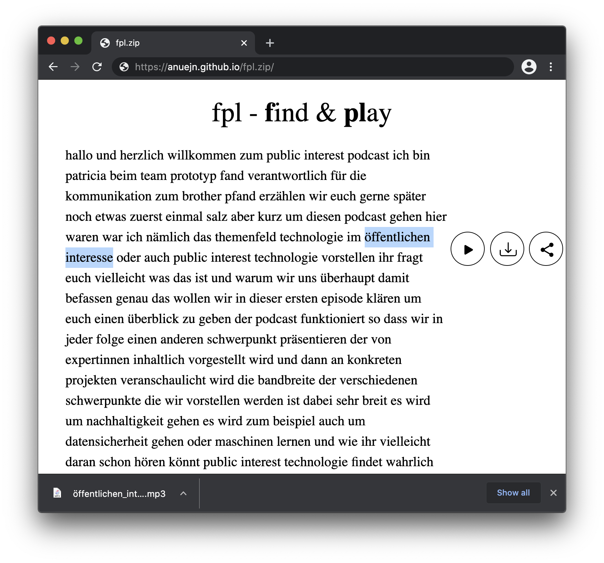

# fpl.zip
Search & cut audiosamples with the help of automatic transcription (Speech to text).

## Try It!
To get a rough view of what this is capable of go to [the gituhub pages version](https://anuejn.github.io/fpl.zip), select some text and play it :).  

To transcribe & sample your own audiofiles, use the `produce.py` script in the backend folder.
* install vosk: `pip install vosk`
* download & unpack [a language moodel](https://alphacephei.com/vosk/models) for the language you want to use
* transcribe the text: `python produce.py MODEL_FOLDER LANG IN_FILE`
* host the resulting file: `npx http-server --cors`
Now you can point fpl.zip to the location of the resulting json (eg. `http://127.0.0.1:8080/yourfile.mp3.json` and sample the file :).
